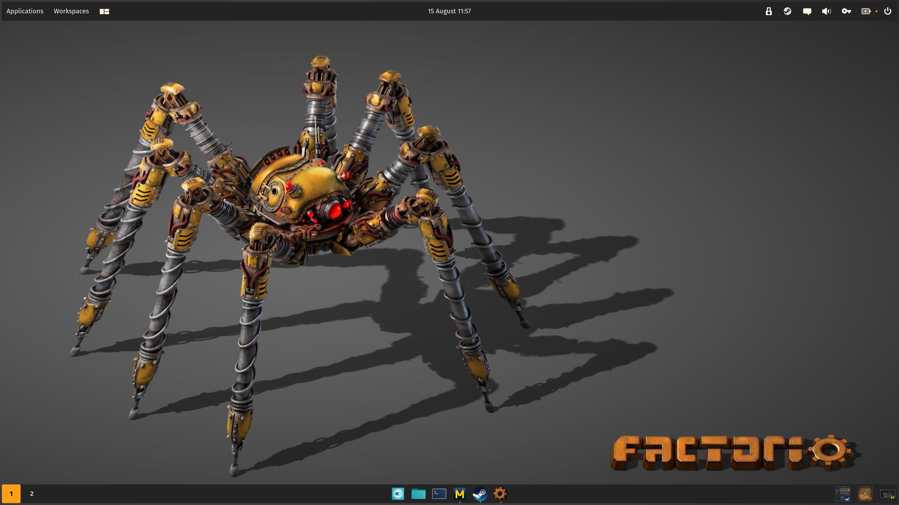
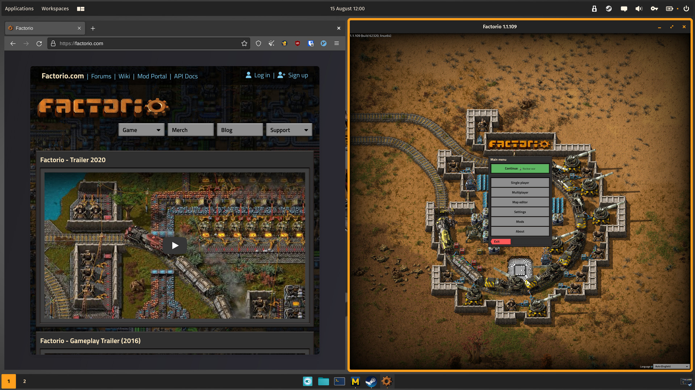
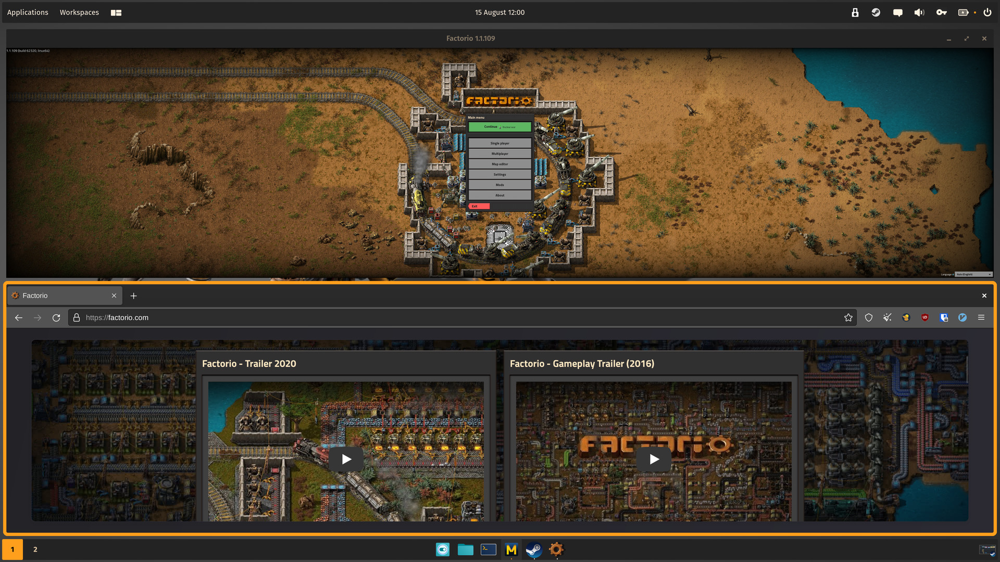
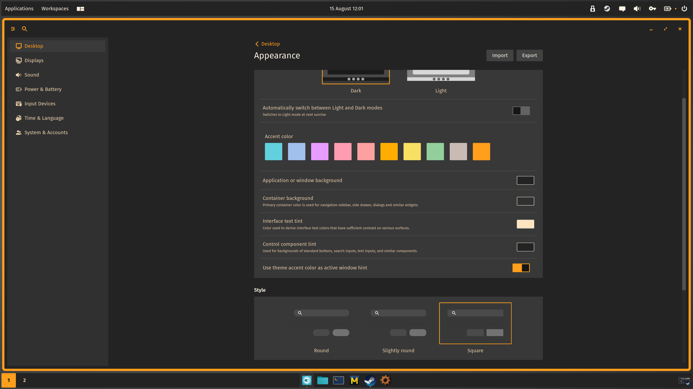

# cosmic-themes-factorio

Cosmic Theme Factorio based on [factorio.com](https://factorio.com/).

## Showcase

|   |  |
| ----------------------------------------------- | ---------------------------------------------- |
|  |   |

## Wallpaper

- [wall.alphacoders.com](https://initiate.alphacoders.com/download/images6/1161891/png)

## Config

- [Factorio.ron](./Factorio.ron)

## Appearance

- Dark: true
- Accent color: #FF9F1C
- Application or window background: #242324
- Container background: #313031
- Interface text tint: #FFE6C0
- Control component tint: #242324
- Use theme accent color as active window hint: true
- Style: Square
- Active window hint size: 6
- Gaps around tiled windows: 12
- Experimental settings > Apply this theme to GNOME apps: true

Other configuration should be visible, just a matter of taste and Factorio UI.
